# 13 期 Substrate 入门课程第五次作业
## 说明： 仅上传关键代码，没有单独上传本地能运行的`substrate-node-template`项目。为了保持作业repo的简洁，相关的`Cargo.toml` 及 runtime中的相关修改没有上传。

## 题目：
1.  实现存证模块的功能，包括：创建存证；撤销存证。
2. 为存证模块添加新的功能，转移存证，接收两个参数，一个是包含的哈希值，另一个是存证的接收账户地址。

## 代码实现详见： src/lib.rs

## 部分代码截图如下：
* 创建存证
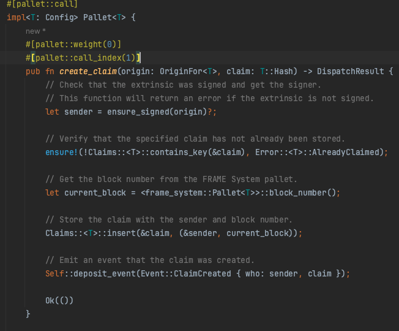

* 撤销存证
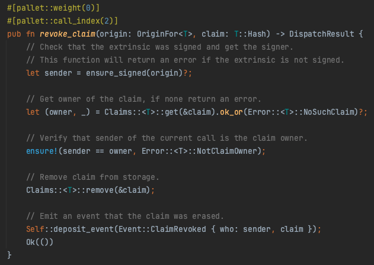

* 转移存证
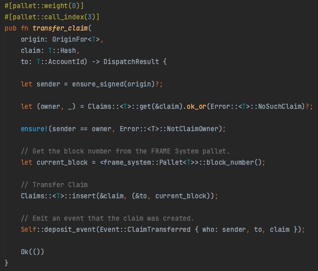

## 运行的效果
1. 用ALICE帐户，创建存证
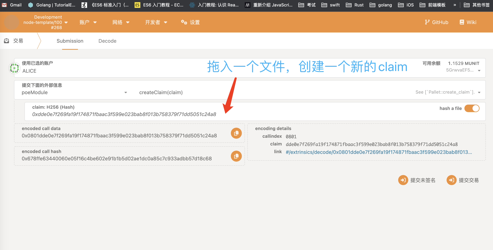

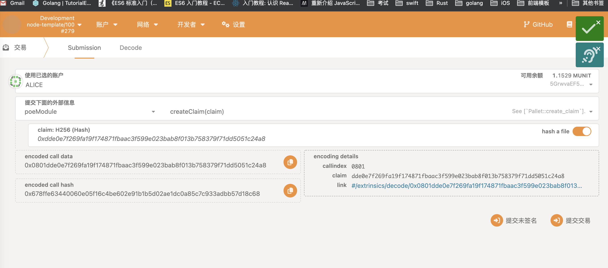

2. 创建后，可以查询到存证的内容
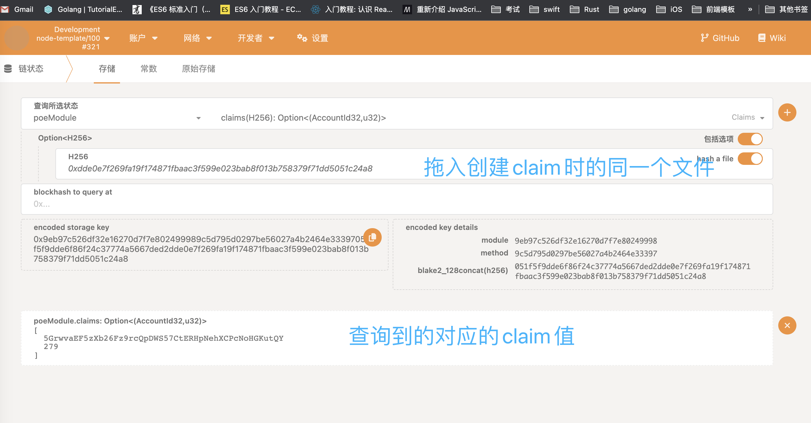

3. ALICE把上面创建的存证，转给BOB
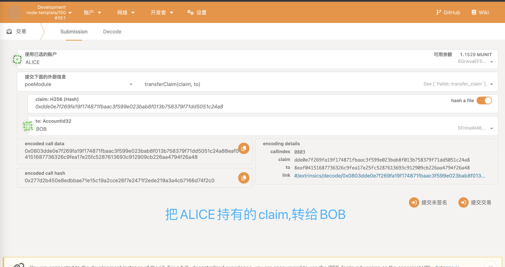

4. 以相同的文件哈希为键，查询的内容与之前不同，因为帐户已经是BOB了
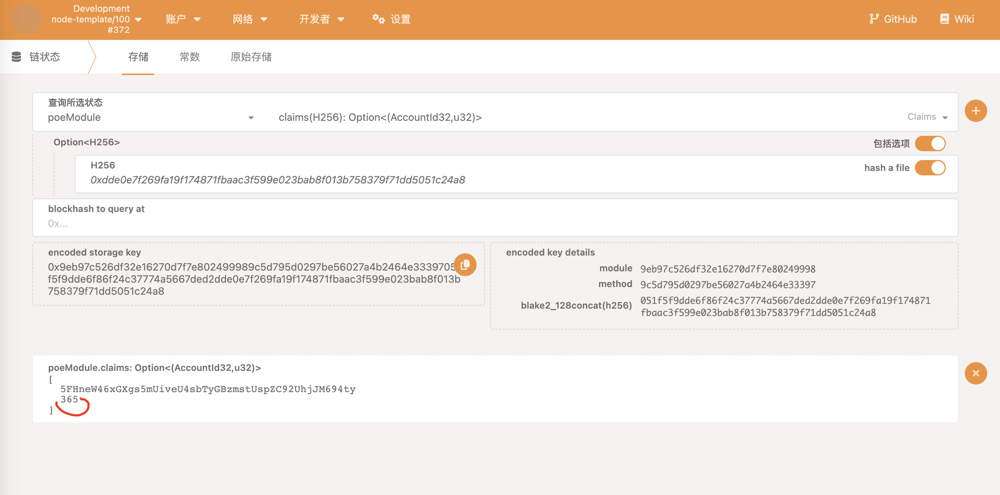

5. 用ALICE帐户，删除存证。删除会失败，因为此时存证的所有者已经是BOB了。
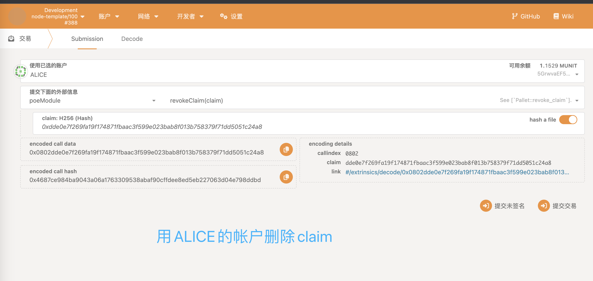

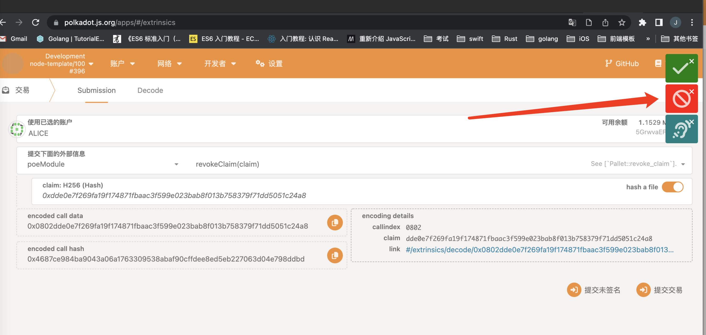

6. 用BOB帐户，删除存证。
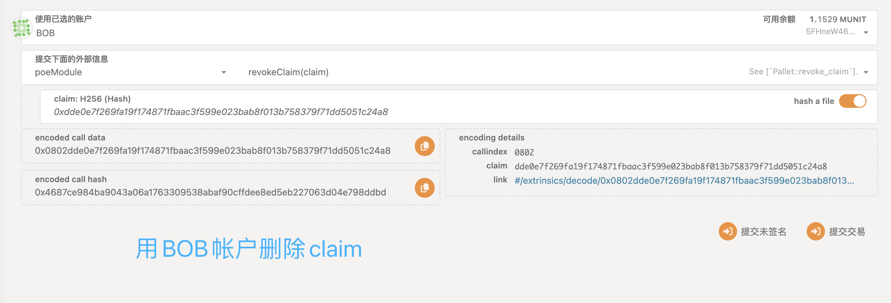

7. 再次以相同的文件哈希为键，查询存证。结果为none，说明已经删除成功了
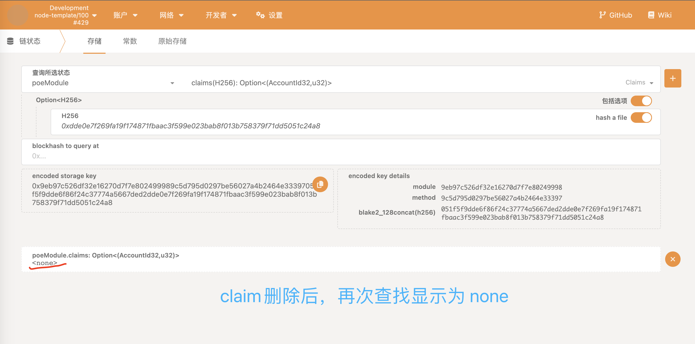

