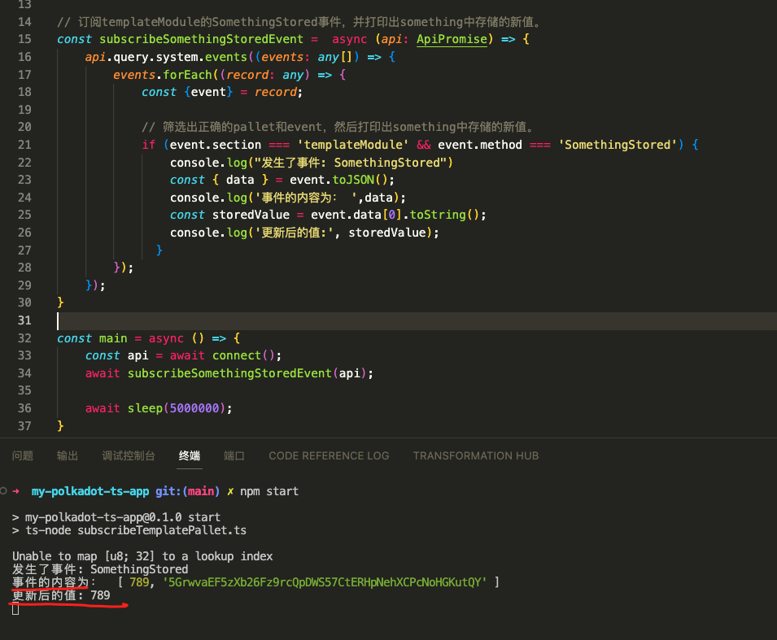

# 13 期 Substrate 入门课程第三次作业
## 题目：编写一个类型脚本程序来订阅template pallet中的值的更新（something）和event。
* 要求：类型脚本源代码；程序运行截图，输出something的新值和SomethingStored的事件

### 代码
1. 代码细节详见：./subscribeTemplatePallet.ts 
2. 核心代码截图如下：
   

### 运行的截图
1. 运行结点
   
2. 运行程序
   
3. 打开浏览器连接到结点，调用`templateModule`中的`dosomething`修改存储中的值。
   
4. 定阅的事件生效，并打印出了更新后的值。
   
  